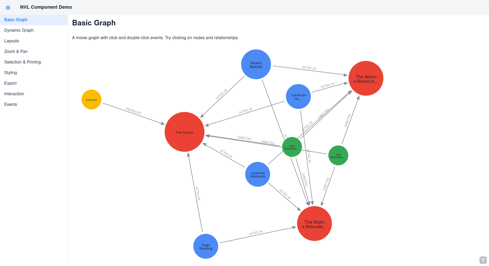
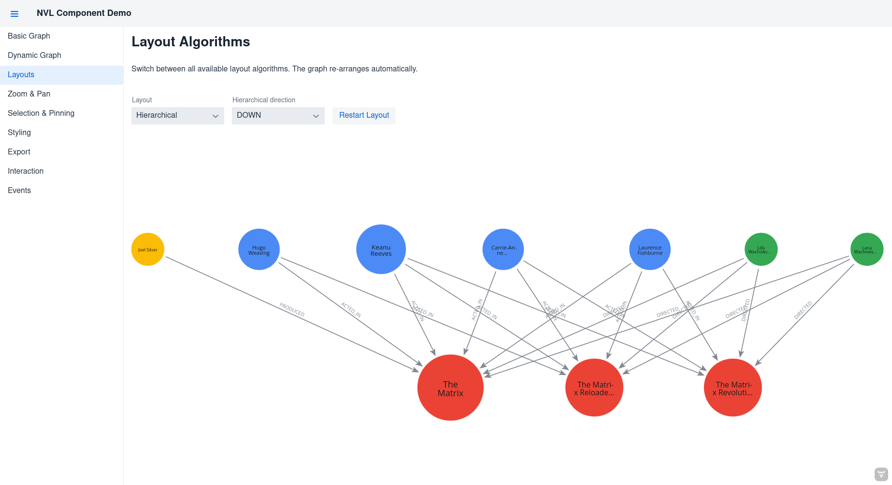
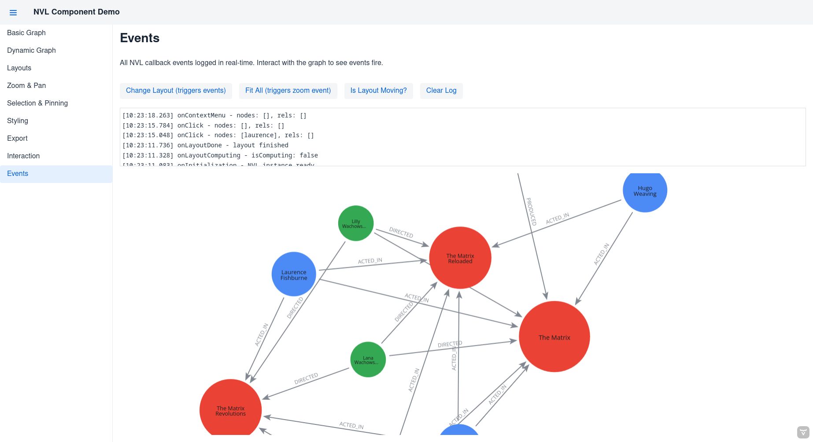
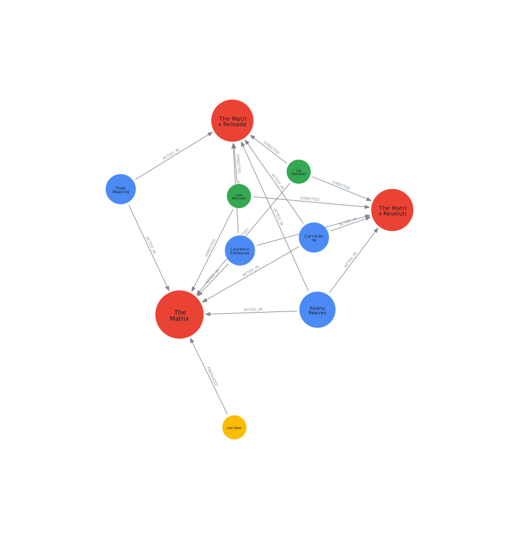

# Vaadin NVL

A Vaadin Flow component (Kotlin) wrapping [Neo4j NVL](https://neo4j.com/docs/nvl/current/) (`@neo4j-nvl/base` 1.1.0) for interactive graph visualization.

## Modules

- **vaadin-nvl** — The library component
- **vaadin-nvl-demo** — Spring Boot demo app showcasing all features

## Quick start

```kotlin
val graph = NvlGraph(NvlOptions(renderer = NvlRenderer.CANVAS))
graph.setSizeFull()
graph.setGraph(
    nodes = listOf(
        NvlNode(id = "1", caption = "Alice", color = "#4C8BF5", size = 30),
        NvlNode(id = "2", caption = "Bob", color = "#EF4444", size = 30),
    ),
    relationships = listOf(
        NvlRelationship(id = "r1", from = "1", to = "2", caption = "KNOWS"),
    ),
)
```

## Features

- **Graph data** — `setGraph`, `addElements`, `updateElements`, `removeNodes`, `removeRelationships`
- **Layouts** — Force-directed, hierarchical, grid, circular, D3 force, free
- **Zoom & pan** — `setZoom`, `setPan`, `fit`, `fitAll`, `resetZoom`
- **Selection & pinning** — `deselectAll`, `pinNode`, `unpinNodes`
- **Node dragging** — `setNodeDraggingEnabled(true)`
- **Styling** — Per-node/relationship color, size, width, caption, captionSize (1-3), captionAlign, disabled, activated
- **Global styling** — `NvlStyling` for default colors, `restart()` to apply
- **Renderer** — Canvas (with captions) or WebGL
- **Export** — `saveToFile`, `saveToSvg`, `saveFullGraphToLargeFile`, `getImageDataUrl`
- **Events** — Click, double-click, context menu, layout done, zoom transition, node drag end
- **Async getters** — `getNodes`, `getRelationships`, `getScale`, `getPan`, `getNodePositions`, etc.

## Screenshots

| Basic Graph | Layout Algorithms |
|:-----------:|:-----------------:|
|  |  |

| Events | SVG Export |
|:------:|:----------:|
|  |  |

## Build & run

```bash
# Build everything
mvn compile

# Run the demo app
mvn -pl vaadin-nvl-demo spring-boot:run
```

Then open http://localhost:8080.

## Requirements

- Java 17+
- Maven 3.8+
