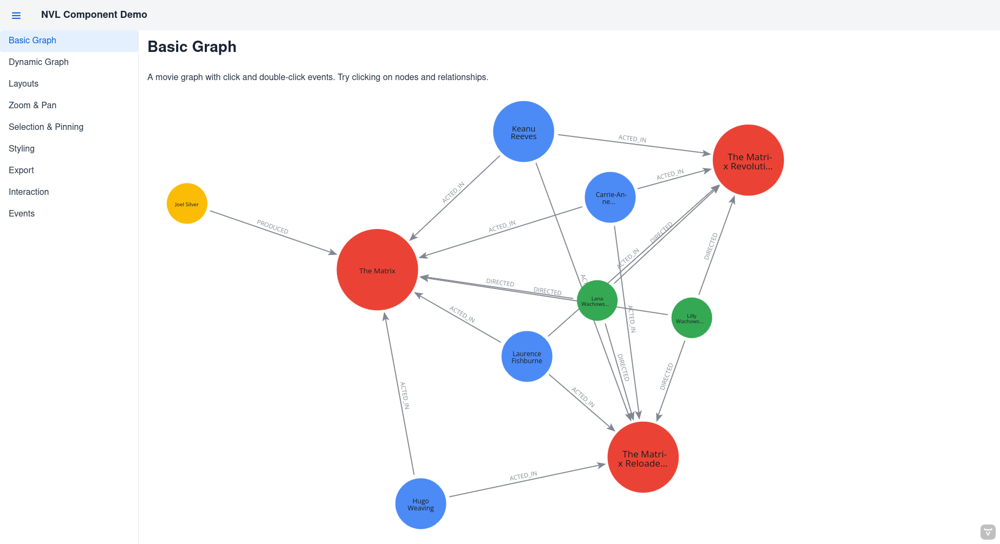
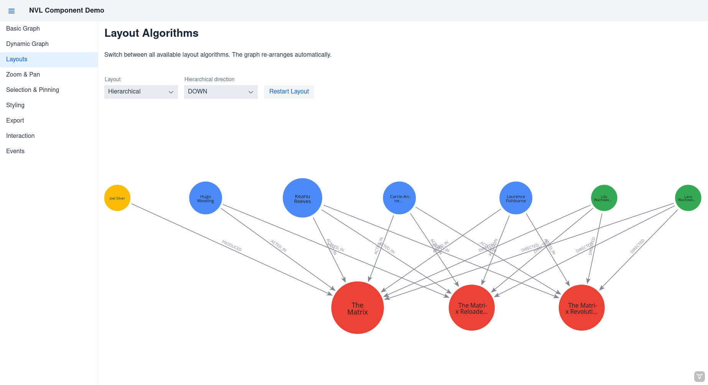
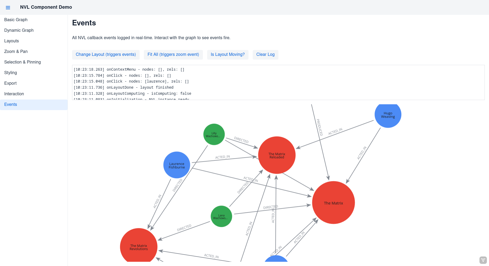
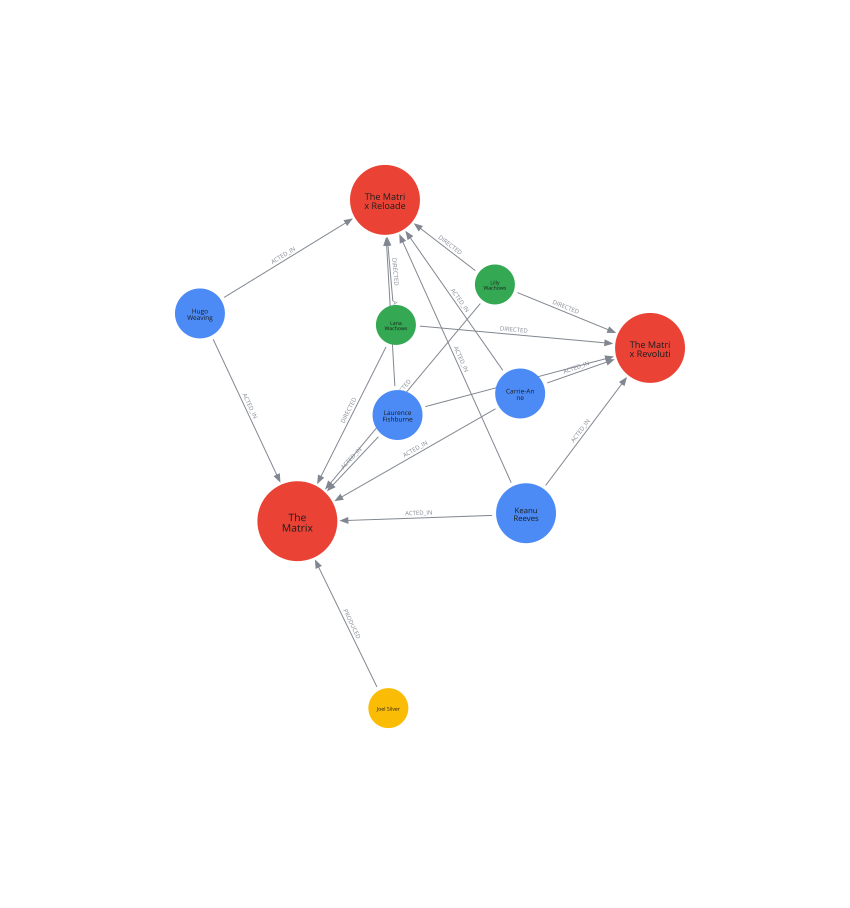
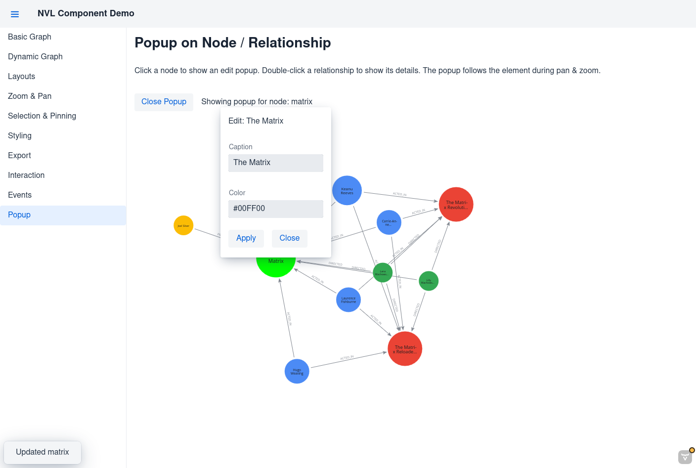

# Vaadin NVL

A Vaadin Flow component (Kotlin) wrapping [Neo4j NVL](https://neo4j.com/docs/nvl/current/) (`@neo4j-nvl/base` 1.1.0) for
interactive graph visualization.

## Modules

- **vaadin-nvl** — The library component
- **vaadin-nvl-demo** — Spring Boot demo app showcasing all features

## Quick start

```kotlin
val graph = NvlGraph(NvlOptions(renderer = NvlRenderer.CANVAS))
graph.setSizeFull()
graph.setGraph(
    nodes = listOf(
        NvlNode(id = "1", caption = "Alice", color = "#4C8BF5", size = 30),
        NvlNode(id = "2", caption = "Bob", color = "#EF4444", size = 30),
    ),
    relationships = listOf(
        NvlRelationship(id = "r1", from = "1", to = "2", caption = "KNOWS"),
    ),
)
```

## Features

- **Graph data** — `setGraph`, `addElements`, `updateElements`, `removeNodes`, `removeRelationships`
- **Layouts** — Force-directed, hierarchical, grid, circular, D3 force, free
- **Zoom & pan** — `setZoom`, `setPan`, `fit`, `fitAll`, `resetZoom`
- **Selection & pinning** — `deselectAll`, `pinNode`, `unpinNodes`
- **Node dragging** — `setNodeDraggingEnabled(true)`
- **Styling** — Per-node/relationship color, size, width, caption, captionSize (1-3), captionAlign, disabled, activated
- **Global styling** — `NvlStyling` for default colors, `restart()` to apply
- **Renderer** — Canvas (with captions) or WebGL
- **Export** — `saveToFile`, `saveToSvg`, `saveFullGraphToLargeFile`, `getImageDataUrl`
- **Events** — Click, double-click, context menu, layout done, zoom transition, node drag end
- **Async getters** — `getNodes`, `getRelationships`, `getScale`, `getPan`, `getNodePositions`, etc.

## Screenshots

|                      Basic Graph                      |                    Layout Algorithms                    |
|:-----------------------------------------------------:|:-------------------------------------------------------:|
|  |  |

|                    Events                    |                    SVG Export                    |
|:--------------------------------------------:|:------------------------------------------------:|
|  |  |

|            Contextual component             |
|:-------------------------------------------:|
|  |

## Build & run

Import maven artifact:

```xml

<dependency>
    <groupId>io.github.adumeige.vaadin-nvl</groupId>
    <artifactId>vaadin-nvl</artifactId>
    <version>1.0.0</version>
</dependency>
```

Or build :

```bash
# Build everything
mvn compile

# Run the demo app
mvn -pl vaadin-nvl-demo spring-boot:run
```

Then open http://localhost:8080.


## Maven Central and release migration

The examples target release `1.0.0`. Once published, Maven Central serves the
dependencies without extra repository declarations or credentials.

- Maven group: `io.github.adumeige.vaadin-nvl`.
- Java/Kotlin package root: `io.github.adumeige.vaadin.nvl`.
- Library modules: `vaadin-nvl`.
- The demo module `vaadin-nvl-demo` is built in CI and excluded from publication.

Consumers must update their dependency group IDs and package imports.
The project keeps its independent parent; it does not need `agentic-parent`
to be published first. Development POMs use `1.0.0-SNAPSHOT`.

Releases are mirrored to [GitHub Packages](https://github.com/adumeige/vaadin-nvl/packages)
and attached to [GitHub Releases](https://github.com/adumeige/vaadin-nvl/releases).
GitHub Packages requires authenticated Maven downloads; Central is recommended.

### Publishing

Configure the same four repository Actions secrets used by the other projects:

| Secret | Value |
| --- | --- |
| `CENTRAL_USERNAME` | Sonatype Central Portal token username |
| `CENTRAL_PASSWORD` | Sonatype Central Portal token password |
| `GPG_PRIVATE_KEY` | Full ASCII-armored exported private signing key |
| `GPG_PASSPHRASE` | Signing key passphrase |

The `io.github.adumeige` namespace must be verified in Central, and the public
signing key must be on a supported keyserver such as `keyserver.ubuntu.com`.
GitHub publishing uses the built-in `GITHUB_TOKEN`; no extra token is needed.

1. Merge the release changes into `main` and check that CI passes.
2. Open **Actions → Build and publish Vaadin NVL → Run workflow**.
3. Select `main` and a new release version, initially `1.0.0`.
4. The workflow creates a versioned POM commit, builds and signs once, and
   automatically publishes to Central. It waits up to an hour for publication;
   no final portal **Publish** click is required.
5. It creates an annotated `v<version>` tag and draft GitHub Release, mirrors and
   verifies the exact signed artifacts in GitHub Packages, attaches downloads,
   and makes the release public with generated notes.

The tag points to the release-version commit; `main` keeps its snapshot version.
Pushes and pull requests verify the reactor and library release archives; they do
not publish. Tags do not trigger publication. Published versions are immutable.
Release artifacts include sources and Dokka API documentation.

### Recover an interrupted release

Central and GitHub publish sequentially. If Central succeeds but the GitHub job
fails, use **Re-run failed jobs** on the same Actions run. Its signed bundle and
release source are retained for 90 days. The mirror skips byte-identical files
already uploaded and rejects conflicting ones. The release remains a draft until
its packages and assets succeed, although the tag may already be visible.

Do not rerun all jobs or start a fresh run for a version already published to
Central. If Central itself fails or times out, inspect the deployment in
[Central Portal](https://central.sonatype.com/publishing/deployments) before recovery:
publication may have continued after the runner stopped. The saved bundle permits
manual recovery without rebuilding.

To verify release artifacts without signing or uploading:

```bash
mvn -Pcentral-release verify -pl '!vaadin-nvl-demo' -Dgpg.skip=true
```

A local `-Pcentral-release deploy` stages for manual approval by default;
the workflow explicitly enables automatic publication.
